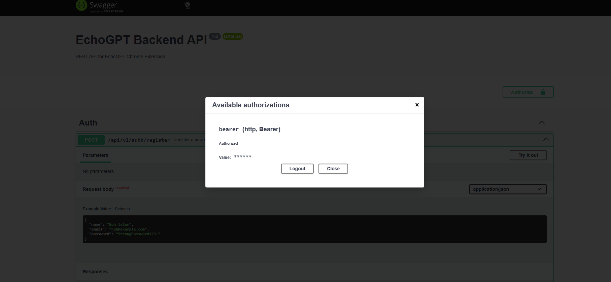
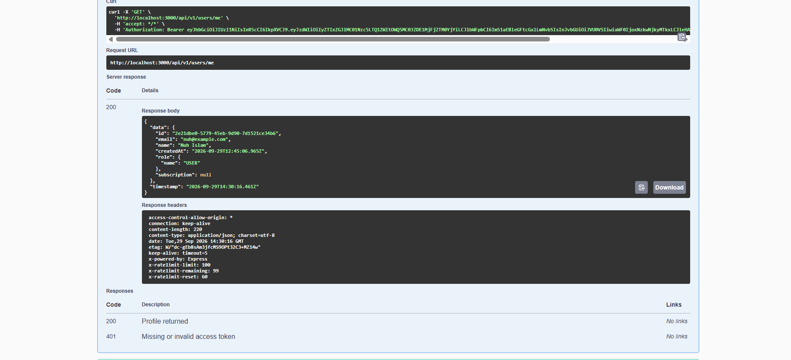
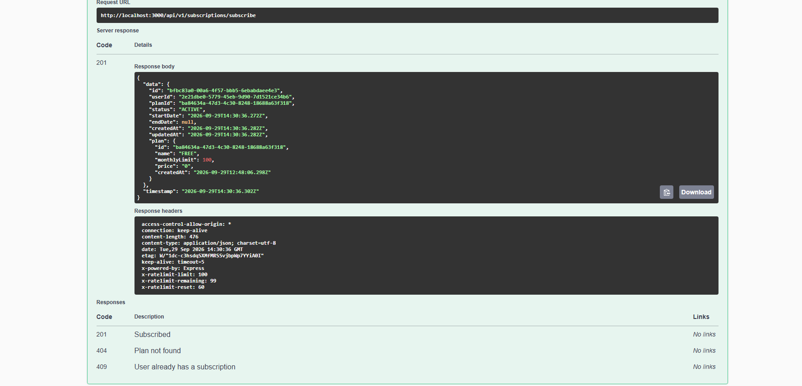

# EchoGPT Backend

A REST API backend for the EchoGPT Chrome Extension, built with NestJS, PostgreSQL (via Prisma 7)
and documented with Swagger/OpenAPI.

## Tech stack

- **Framework:** NestJS 12
- **Database:** PostgreSQL, accessed through Prisma ORM 7 (using the `@prisma/adapter-pg` driver adapter and a generated client)
- **Auth:** JWT access tokens + rotating refresh tokens (via `@nestjs/jwt` and `passport-jwt`)
- **Docs:** Swagger / OpenAPI (`@nestjs/swagger`)
- **Validation:** `class-validator` / `class-transformer`
- **Rate limiting:** `@nestjs/throttler`

## Features

- **Auth** : register, login, JWT access + refresh tokens (rotated on every refresh), logout (single
  session or all sessions), rate-limited login/register.
- **Users** : profile (get/update), change password, delete account. The last remaining admin
  account cannot be demoted or deleted.
- **Subscriptions** : FREE/PREMIUM plans (seeded), automatic FREE-plan provisioning on registration,
  upgrade/downgrade, subscribe/cancel, monthly usage tracking, and a monthly AI-request limit
  enforced on the chat endpoint (admins bypass the limit).
- **AI providers** : pluggable adapters for OpenAI, Anthropic (Claude) and Google Gemini behind a
  common interface. Admins can add/edit/enable/disable providers, pick a default, and run a live
  health check. API keys are encrypted at rest (AES-256-GCM) and are never returned by the API.
- **Chat** : conversations with full message history, provider selection (or use the configured
  default), usage logging, and a 502 response (not a generic 500) when the upstream provider fails.
- **Web search** : search (via DuckDuckGo), search history, recent (deduplicated) queries, and
  autocomplete suggestions that combine the user's own history with an external suggestion API.
- **Admin panel** : dashboard stats, system health (uptime/memory/DB latency), user management
  (list/get/delete/change role), subscription management (list/force-set status), and request/usage
  logs.
- **Security** : bcrypt password hashing, JWT auth guard + role guard applied globally (opt out with
  `@Public()`), global rate limiting (100 req/min) with a stricter limit on login/register (5/min),
  encrypted provider API keys, CORS enabled, request validation on every DTO.

## Project structure

```
src/
├── auth/            # register/login/refresh/logout, JWT strategies & guards
├── users/           # profile, password, account deletion
├── subscriptions/   # plans, subscribe/cancel/upgrade/downgrade, usage limits
├── providers/        # AI provider CRUD + OpenAI/Claude/Gemini adapters
├── chat/            # conversations & messages
├── search/          # web search, history, suggestions
├── admin/           # admin-only dashboard, user/subscription management
├── health/          # public health check
├── prisma/          # PrismaService/PrismaModule + seed script
├── common/          # shared decorators, guards, filters, interceptors, enums
└── generated/prisma/ # Prisma-generated client (not committed, see below)
```

## Prerequisites

Install these before you start, and confirm each one with its check command:

| Requirement | Check | Get it |
|---|---|---|
| **Node.js 22+** (developed on 24) | `node -v` | [nodejs.org](https://nodejs.org/) |
| **npm 10+** (bundled with Node) | `npm -v` | comes with Node |
| **Git** | `git --version` | [git-scm.com](https://git-scm.com/) |
| **Docker Desktop** (for the bundled Postgres container) | `docker --version` | [docker.com](https://www.docker.com/products/docker-desktop/) |

You don't strictly need Docker if you already have a PostgreSQL 16 server available — see step 3.

> **Windows users:** make sure Docker Desktop is actually **running** (check the system tray) before
> step 3 — `docker compose` fails immediately if the Docker engine isn't up.

## Setup

### Quick start 

```bash
git clone https://github.com/nuhb008/echogpt-backend.git
cd echogpt-backend
npm install
cp .env.example .env
# edit .env: fill in JWT_ACCESS_SECRET, JWT_REFRESH_SECRET, ENCRYPTION_KEY (see step 2 below)
docker compose up -d
npx prisma migrate dev
npx prisma db seed
npm run start:dev
```

Then open **http://localhost:3000/docs** and **http://localhost:3000/api/v1/health**. If either of
those fails, follow the detailed steps below — each one explains what can go wrong.

### 1. Clone the repository and install dependencies

```bash
git clone https://github.com/nuhb008/echogpt-backend.git
cd echogpt-backend
npm install
```

If `npm install` fails, run `node -v` and confirm it's 22 or newer — older Node versions aren't
supported by some of the dependencies (notably Prisma 7).

### 2. Configure environment variables

```bash
cp .env.example .env
```

(On Windows PowerShell, use `Copy-Item .env.example .env` instead.)

Open `.env` and fill in three secrets — the placeholders in `.env.example` will not work as-is:

```bash
# JWT_ACCESS_SECRET and JWT_REFRESH_SECRET: any long random string, must be different from each other
node -e "console.log(require('crypto').randomBytes(48).toString('hex'))"

# ENCRYPTION_KEY: must be EXACTLY 64 hex characters (32 bytes) — used to encrypt AI provider API keys
node -e "console.log(require('crypto').randomBytes(32).toString('hex'))"
```

Run each command once, and paste its output into the matching variable in `.env`. Everything else
in `.env.example` already has a working default for local development.

### 3. Start PostgreSQL

```bash
docker compose up -d
docker ps
```

You should see a container named `echogpt-postgres` with status `Up`. This maps the container's
Postgres to **host port 5433** (not the usual 5432) — this is deliberate: a locally installed
PostgreSQL service very commonly already listens on 5432, and if this project also tried to bind
5432 your connections would silently go to the wrong database. `DATABASE_URL` in `.env.example`
already points at port 5433, so you don't need to change anything unless you edit
`docker-compose.yml` yourself.

> **Using your own PostgreSQL instead of Docker?** Skip this step and point `DATABASE_URL` in
> `.env` at your own PostgreSQL 16+ server. Everything downstream (migrations, seeding, running the
> app) works the same either way.

### 4. Run migrations and generate the Prisma client

```bash
npx prisma migrate dev
```

This creates all the database tables from `prisma/schema.prisma` and generates the Prisma client
into `src/generated/prisma` (this folder is gitignored — it's regenerated here, not committed).

If this fails with an authentication or connection error, double-check:
- `docker ps` shows the container as `Up` (step 3)
- `DATABASE_URL` in `.env` matches the port in `docker-compose.yml` (5433 by default)
- nothing else is already using port 5433 — check with `netstat -ano | findstr 5433` (Windows) or
  `lsof -i :5433` (macOS/Linux)

### 5. Seed the database

```bash
npx prisma db seed
```

This creates:
- Roles: `USER`, `ADMIN`
- Subscription plans: `FREE` (100 requests/month, $0) and `PREMIUM` (5000 requests/month, $9.99)
- An admin account: `admin@echogpt.com` / `Admin123!` (override with `SEED_ADMIN_EMAIL` /
  `SEED_ADMIN_PASSWORD` in `.env` before seeding)

`npx prisma db seed` runs `npm run seed`, which builds the project and runs the compiled seed
script — this is needed because the seed script imports the generated Prisma client, which itself
uses ESM-style `.js` import specifiers that only resolve once compiled. This means the first seed
takes a few extra seconds while it builds; that's expected.

You can run this command again any time — it's idempotent (uses upserts), so re-seeding won't
create duplicates or fail on an already-seeded database.

### 6. Run the API

```bash
npm run start:dev
```

Wait for the log line `Nest application successfully started`. The API then listens on
`http://localhost:3000` (or `PORT` from `.env`), with all routes under the `/api/v1` prefix.

### 7. Verify it's working

```bash
curl http://localhost:3000/api/v1/health
```

should return `{"data":{"status":"ok","database":"up",...}}`. Then open
**http://localhost:3000/docs** in a browser to confirm Swagger UI loads, and try logging in with
the seeded admin account (`admin@echogpt.com` / `Admin123!`) via `POST /auth/login` — see
"API documentation" below for how to use the returned token.

### Troubleshooting

| Symptom | Likely cause / fix |
|---|---|
| `docker compose up -d` hangs or errors immediately | Docker Desktop isn't running — start it first |
| Migration fails with "Authentication failed against database server" | Something else is already using port 5433 (or 5432, if you changed the mapping), so you're connecting to the wrong Postgres. Check `docker ps` and `netstat`/`lsof` as in step 4 |
| `Cannot GET /` in the browser | Expected — there's no route at the bare root. Use `/api/v1/health` or `/docs` instead |
| `401 Unauthorized` on a protected endpoint in Swagger UI | You haven't clicked **Authorize** and pasted a valid `accessToken` yet — see "API documentation" below |
| `429 Too Many Requests` on login/register | You've hit the 5-requests/minute limit on those two endpoints specifically (brute-force protection) — wait 60 seconds |
| `EADDRINUSE` / port 3000 already in use | Another process (maybe an earlier `npm run start:dev`) is still running. Stop it, or set a different `PORT` in `.env` |
| `npx prisma db seed` seems to do nothing / fast-exits without output | Make sure you're on a version of this repo where `prisma7.config.ts` points `migrations.seed` at `npm run seed` (already the case in this repo) |

## API documentation

Swagger UI: **http://localhost:3000/docs**
Raw OpenAPI JSON: **http://localhost:3000/docs-json**

Every endpoint documents its summary, request body, and the status codes it can return. To use it
in Postman instead: **File → Import → paste `http://localhost:3000/docs-json`** — Postman imports
OpenAPI documents directly, so no separate collection file is needed (and can't drift out of sync
with the actual API).

To try authenticated endpoints in Swagger UI: call `POST /auth/login`, copy the `accessToken` from
the response, then click **Authorize** (top right) and paste it in as a bearer token. This is
persisted across page reloads, so you only need to do it once per browser tab.

### Screenshots

<p align="center"></p>

The **Authorize** button (top right, next to the title) is what unlocks every protected endpoint
below it — see "API documentation" above for the exact steps.

### Example: an authenticated request end-to-end

<p align="center"></p>

The Authorize dialog after pasting in a token: it now says **Authorized**, and the value is masked
(shown as `******`) for safety. This state is what `persistAuthorization` keeps across reloads.

<p align="center"></p>

`GET /users/me` called from Swagger UI once authorized — note the generated curl command now
includes `-H 'Authorization: Bearer ...'` automatically, and the response is a real `200` with the
logged-in user's profile (id, email, name, role, subscription).

<p align="center"></p>

`POST /subscriptions/subscribe` returning a real `201` with the created subscription nested inside
its plan (`FREE`, 100 requests/month) — and the documented alternative responses (`404` plan not
found, `409` already subscribed) shown right below it, exactly as declared by the `@ApiResponse`
decorators on that endpoint.

<details>
<summary>All endpoint groups (click to expand)</summary>

<p align="center"></p>
<p align="center"></p>
<p align="center"></p>
<p align="center"></p>
<p align="center"></p>

</details>

## Running tests

```bash
npm test        # unit tests
npm run test:cov
```

## Notes on some design choices

- **Refresh tokens** are stored server-side as a SHA-256 hash in the `Session` table (never the raw
  token), and rotated on every use — the old token is deleted the moment a new one is issued, so a
  stolen, already-used refresh token stops working.
- **Provider API keys** are encrypted with AES-256-GCM using `ENCRYPTION_KEY` before being stored,
  and are never included in any API response.
- **Usage limits** are counted from `UsageLog` rows for the `chat.sendMessage` endpoint within the
  current calendar month, compared against the user's plan's `monthlyLimit`. Admins are exempt.
- **AI provider adapters** (`src/providers/adapters/`) all implement the same
  `AIProviderAdapter.complete()` interface, so `ChatService` and `ProvidersService` don't need any
  provider-specific branching — adding a fourth provider only means adding one adapter class.


