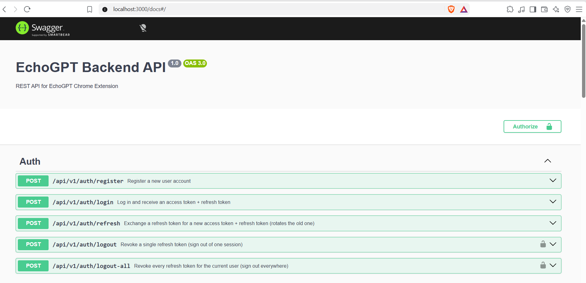
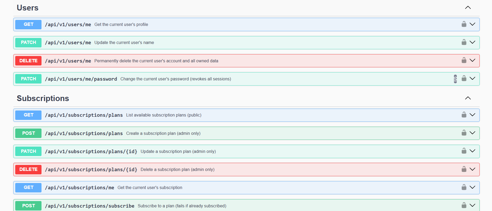
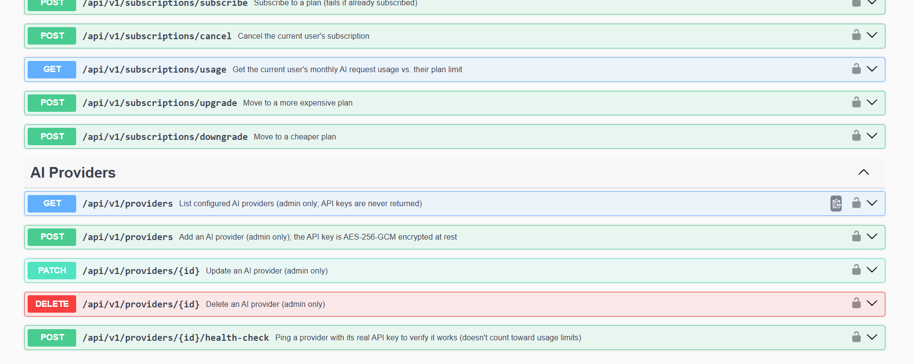
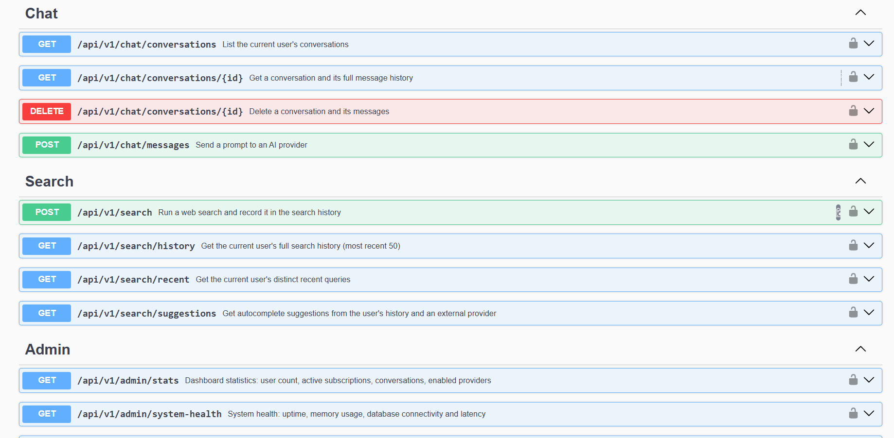
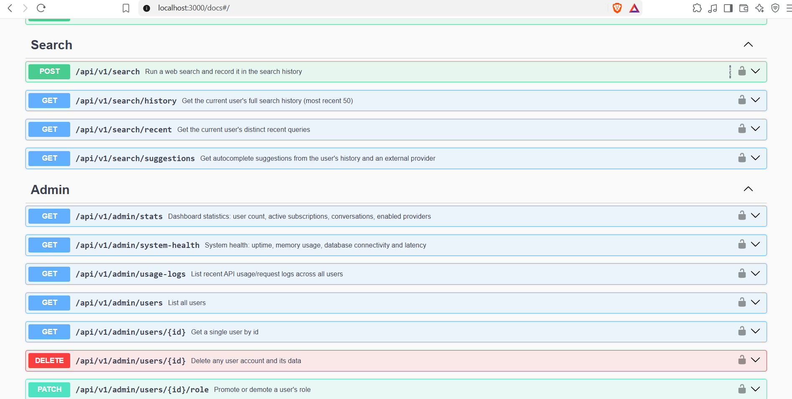
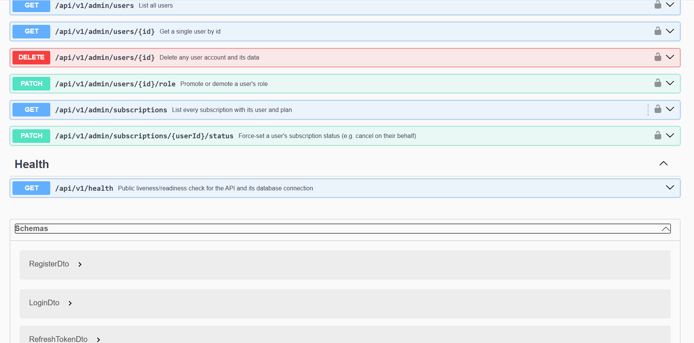

# EchoGPT Backend

A REST API backend for the EchoGPT Chrome Extension, built with NestJS, PostgreSQL (via Prisma 7)
and documented with Swagger/OpenAPI.

## Tech stack

- **Framework:** NestJS 12
- **Database:** PostgreSQL, accessed through Prisma ORM 7 (using the `@prisma/adapter-pg` driver adapter and a generated client)
- **Auth:** JWT access tokens + rotating refresh tokens (via `@nestjs/jwt` and `passport-jwt`)
- **Docs:** Swagger / OpenAPI (`@nestjs/swagger`)
- **Validation:** `class-validator` / `class-transformer`
- **Rate limiting:** `@nestjs/throttler`

## Features

- **Auth** : register, login, JWT access + refresh tokens (rotated on every refresh), logout (single
  session or all sessions), rate-limited login/register.
- **Users** : profile (get/update), change password, delete account. The last remaining admin
  account cannot be demoted or deleted.
- **Subscriptions** : FREE/PREMIUM plans (seeded), automatic FREE-plan provisioning on registration,
  upgrade/downgrade, subscribe/cancel, monthly usage tracking, and a monthly AI-request limit
  enforced on the chat endpoint (admins bypass the limit).
- **AI providers** : pluggable adapters for OpenAI, Anthropic (Claude) and Google Gemini behind a
  common interface. Admins can add/edit/enable/disable providers, pick a default, and run a live
  health check. API keys are encrypted at rest (AES-256-GCM) and are never returned by the API.
- **Chat** : conversations with full message history, provider selection (or use the configured
  default), usage logging, and a 502 response (not a generic 500) when the upstream provider fails.
- **Web search** : search (via DuckDuckGo), search history, recent (deduplicated) queries, and
  autocomplete suggestions that combine the user's own history with an external suggestion API.
- **Admin panel** : dashboard stats, system health (uptime/memory/DB latency), user management
  (list/get/delete/change role), subscription management (list/force-set status), and request/usage
  logs.
- **Security** : bcrypt password hashing, JWT auth guard + role guard applied globally (opt out with
  `@Public()`), global rate limiting (100 req/min) with a stricter limit on login/register (5/min),
  encrypted provider API keys, CORS enabled, request validation on every DTO.

## Project structure

```
src/
├── auth/            # register/login/refresh/logout, JWT strategies & guards
├── users/           # profile, password, account deletion
├── subscriptions/   # plans, subscribe/cancel/upgrade/downgrade, usage limits
├── providers/        # AI provider CRUD + OpenAI/Claude/Gemini adapters
├── chat/            # conversations & messages
├── search/          # web search, history, suggestions
├── admin/           # admin-only dashboard, user/subscription management
├── health/          # public health check
├── prisma/          # PrismaService/PrismaModule + seed script
├── common/          # shared decorators, guards, filters, interceptors, enums
└── generated/prisma/ # Prisma-generated client (not committed, see below)
```

## Prerequisites

- Node.js 22+ (tested on Node 24)
- Docker Desktop (for the bundled PostgreSQL container) — or your own PostgreSQL 16 instance

## Setup

### 1. Install dependencies

```bash
npm install
```

### 2. Configure environment variables

```bash
cp .env.example .env
```

Fill in `JWT_ACCESS_SECRET`, `JWT_REFRESH_SECRET` and `ENCRYPTION_KEY` with real random values:

```bash
node -e "console.log(require('crypto').randomBytes(48).toString('hex'))"   # JWT secrets
node -e "console.log(require('crypto').randomBytes(32).toString('hex'))"   # ENCRYPTION_KEY (must be 64 hex chars)
```

### 3. Start PostgreSQL

```bash
docker compose up -d
```

This starts Postgres on **host port 5433** (mapped from the container's 5432) to avoid clashing with
a locally installed PostgreSQL service, which often also listens on 5432. `DATABASE_URL` in
`.env.example` already points at port 5433.

> If you'd rather use your own PostgreSQL instance, just point `DATABASE_URL` at it instead of
> running the container.

### 4. Run migrations and generate the Prisma client

```bash
npx prisma migrate dev
```

This also generates the Prisma client into `src/generated/prisma` (gitignored — it's regenerated
from `prisma/schema.prisma`, not committed).

### 5. Seed the database

```bash
npx prisma db seed
```

This creates:
- Roles: `USER`, `ADMIN`
- Subscription plans: `FREE` (100 requests/month, $0) and `PREMIUM` (5000 requests/month, $9.99)
- An admin account: `admin@echogpt.com` / `Admin123!` (override with `SEED_ADMIN_EMAIL` /
  `SEED_ADMIN_PASSWORD` in `.env`)

`npx prisma db seed` runs `npm run seed`, which builds the project and runs the compiled seed
script — this is needed because the seed script imports the generated Prisma client, which itself
uses ESM-style `.js` import specifiers that only resolve once compiled.

### 6. Run the API

```bash
npm run start:dev
```

The API listens on `http://localhost:3000` (or `PORT` from `.env`), with all routes under the
`/api/v1` prefix.

## API documentation

Swagger UI: **http://localhost:3000/docs**
Raw OpenAPI JSON: **http://localhost:3000/docs-json**

Every endpoint documents its summary, request body, and the status codes it can return. To use it
in Postman instead: **File → Import → paste `http://localhost:3000/docs-json`** — Postman imports
OpenAPI documents directly, so no separate collection file is needed (and can't drift out of sync
with the actual API).

To try authenticated endpoints in Swagger UI: call `POST /auth/login`, copy the `accessToken` from
the response, then click **Authorize** (top right) and paste it in as a bearer token. This is
persisted across page reloads, so you only need to do it once per browser tab.

### Screenshots

<p align="center"></p>

The **Authorize** button (top right, next to the title) is what unlocks every protected endpoint
below it — see "API documentation" above for the exact steps.

<details>
<summary>All endpoint groups (click to expand)</summary>

<p align="center"></p>
<p align="center"></p>
<p align="center"></p>
<p align="center"></p>
<p align="center"></p>

</details>

## Running tests

```bash
npm test        # unit tests
npm run test:cov
```

## Notes on some design choices

- **Refresh tokens** are stored server-side as a SHA-256 hash in the `Session` table (never the raw
  token), and rotated on every use — the old token is deleted the moment a new one is issued, so a
  stolen, already-used refresh token stops working.
- **Provider API keys** are encrypted with AES-256-GCM using `ENCRYPTION_KEY` before being stored,
  and are never included in any API response.
- **Usage limits** are counted from `UsageLog` rows for the `chat.sendMessage` endpoint within the
  current calendar month, compared against the user's plan's `monthlyLimit`. Admins are exempt.
- **AI provider adapters** (`src/providers/adapters/`) all implement the same
  `AIProviderAdapter.complete()` interface, so `ChatService` and `ProvidersService` don't need any
  provider-specific branching — adding a fourth provider only means adding one adapter class.


